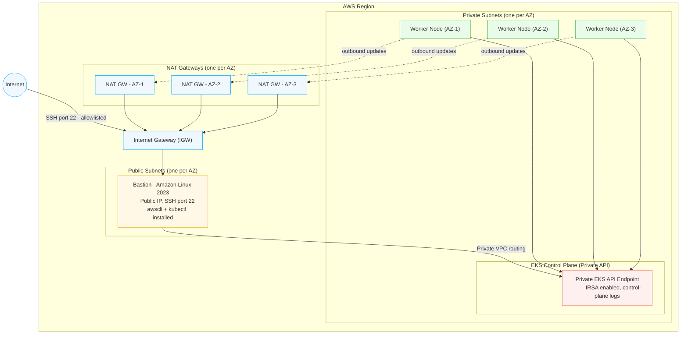

# Production-Ready EKS Cluster using Terraform

I built this because most EKS tutorials leave the API server wide open, skip logging, and don't bother with CI/CD. This repo gives you a fully private EKS cluster, a proper VPC, a bastion host, and a GitHub Actions pipeline — all wired up and ready to go.

**Built with:** Terraform, AWS (EKS, VPC, EC2, IAM), GitHub Actions

---

## What this sets up

- A **private EKS cluster** — the Kubernetes API is not exposed to the internet
- A **multi-AZ VPC** with public and private subnets (3 AZs by default, configurable)
- **One NAT gateway per AZ** so there's no single point of failure
- A **bastion host** running Amazon Linux 2023 in a public subnet, with `kubectl` already installed
- SSH to the bastion is **locked down to your IP range** — not open to `0.0.0.0/0`
- **IMDSv2 enforced** on the bastion to block SSRF-based credential theft
- The bastion IAM role only has `eks:DescribeCluster` — the bare minimum needed for `aws eks update-kubeconfig`
- Cluster-admin access uses **EKS Access Entries** (not the old `aws-auth` configmap approach)
- **IRSA** (IAM Roles for Service Accounts) is enabled
- All **5 control-plane log types** go to CloudWatch
- A **GitHub Actions pipeline** with manual dispatch — you pick the action and environment
- No secrets in git — `.tfvars` come from **GitHub Environment secrets**

---

## Architecture



The cluster API is completely private. You SSH into the bastion, and from there you run kubectl. That's the only way in.

---

## Repo layout

```
├── main.tf                       # calls the eks-core module
├── variables.tf                  # all the knobs you can turn
├── output.tf                     # cluster name, bastion IP, SSH command
├── provider.tf                   # AWS provider + S3 backend
├── .github/workflows/
│   └── terraform.yml             # CI/CD pipeline
└── modules/eks-core/
    ├── vpc.tf                    # VPC, subnets, NAT gateways
    ├── eks.tf                    # EKS cluster, node group, access entries
    ├── bastion_ec2.tf            # bastion EC2 instance
    ├── bastion_iam.tf            # IAM role + minimal policy
    ├── bastion_sg.tf             # security group (SSH allowlist)
    ├── bastion_key.tf            # auto-generated RSA 4096 key pair
    ├── data.tf                   # AZ lookup, AMI data source
    ├── locals.tf                 # shared tags
    ├── variables.tf              # module inputs
    └── outputs.tf                # module outputs
```

Everything lives in one module (`eks-core`). The root just calls it and passes variables.

---

## How to deploy

### Prerequisites

- Terraform >= 1.6
- AWS CLI v2, configured with valid credentials
- An S3 bucket for Terraform state

### Steps

Clone and cd in:

```bash
git clone https://github.com/<your-org>/Production-Ready-EKS-Cluster-using-Terraform.git
cd Production-Ready-EKS-Cluster-using-Terraform
```

Create a `terraform.tfvars` file (this is git-ignored, so it won't get pushed):

```hcl
region            = "ap-south-1"
name              = "prod"
vpc_cidr          = "10.20.0.0/16"
az_count          = 3
cluster_version   = "1.29"
allowed_ssh_cidrs = ["203.0.113.10/32"]   # your VPN or office IP
node_min_size     = 3
node_desired_size = 3
node_max_size     = 6
node_instance_types = ["t3.xlarge"]
tags = {
  Environment = "prod"
  ManagedBy   = "terraform"
}
```

Init with S3 backend, then plan and apply:

```bash
terraform init \
  -backend-config="bucket=my-tf-state-bucket" \
  -backend-config="key=eks/prod/terraform.tfstate" \
  -backend-config="region=ap-south-1"

terraform plan -var-file="terraform.tfvars"
terraform apply -var-file="terraform.tfvars"
```

### Connecting to the cluster

Once it's up, grab the bastion key and SSH in:

```bash
terraform output -raw bastion_private_key_pem > bastion_key.pem
chmod 600 bastion_key.pem
ssh -i bastion_key.pem ec2-user@$(terraform output -raw bastion_public_ip)
```

Then on the bastion:

```bash
aws eks update-kubeconfig --name prod-eks --region ap-south-1
kubectl get nodes
```

You should see your nodes come up.

---

## CI/CD pipeline

There's a GitHub Actions workflow that uses `workflow_dispatch`. You go to the Actions tab, click "Run workflow", and pick:

- **Action** — `validate`, `plan`, or `apply`
- **Environment** — `dev`, `staging`, or `prod`

```
Checkout > AWS Auth > Write tfvars > Init > fmt check > Validate > Plan > Apply
                                                                         ^
                                                              only runs if you picked "apply"
```

Some things I baked in:
- **Concurrency lock per environment** — two people can't run against the same env simultaneously
- The **plan gets saved as an artifact** for 30 days so you can go back and review it
- The tfvars file is **written from a GitHub secret at runtime** and **deleted after the run finishes**
- Nothing sensitive is committed to the repo

### Setting it up

1. In your repo go to **Settings > Environments** and create `dev`, `staging`, `prod`
2. Add these secrets to each environment:
   - `TFVARS_FILE` — paste the entire `.tfvars` content for that env
   - `AWS_ACCESS_KEY_ID`
   - `AWS_SECRET_ACCESS_KEY`
3. Open `.github/workflows/terraform.yml` and update `TF_BACKEND_BUCKET` with your S3 bucket name
4. Go to Actions > Terraform EKS Pipeline > Run workflow

---

## Variables reference

| Variable | Type | Default | What it does |
|---|---|---|---|
| `region` | string | `ap-south-1` | AWS region |
| `name` | string | `prod` | Prefix for resource names |
| `vpc_cidr` | string | `10.20.0.0/16` | VPC CIDR block |
| `az_count` | number | `3` | Number of AZs to use |
| `cluster_version` | string | `1.29` | Kubernetes version |
| `allowed_ssh_cidrs` | list(string) | *required* | IPs allowed to SSH to bastion |
| `node_min_size` | number | `3` | Min nodes |
| `node_desired_size` | number | `3` | Desired nodes |
| `node_max_size` | number | `6` | Max nodes |
| `node_instance_types` | list(string) | `["t3.micro"]` | Instance types for worker nodes |
| `tags` | map(string) | `{}` | Extra tags applied to everything |

## Outputs

| Output | What you get |
|---|---|
| `cluster_name` | EKS cluster name |
| `bastion_public_ip` | Public IP of the bastion |
| `bastion_ssh_command` | Ready-to-paste SSH command |
| `bastion_private_key_pem` | SSH private key (sensitive) |

---

## Security notes

A few decisions worth calling out:

- The EKS API endpoint is **private only**. There's no public access. You go through the bastion.
- The bastion SG only allows SSH from CIDRs you explicitly list. Don't put `0.0.0.0/0` there.
- IMDSv2 is required on the bastion (`http_tokens = "required"`).
- The bastion IAM role can only call `eks:DescribeCluster`. Cluster-admin is granted through EKS Access Entries, not through broad IAM permissions.
- The SSH key is auto-generated (RSA 4096) and stored in Terraform state — encrypt your S3 backend.
- All 5 EKS control-plane log types are enabled and sent to CloudWatch.
- `.tfvars` files are in `.gitignore`. In CI, they come from GitHub secrets and get cleaned up after every run.

---

## Saving costs in dev/staging

For non-prod environments you can dial things down:

- Use `az_count = 2` instead of 3
- Pick smaller instances like `t3.medium` or `t3.small`
- You could switch to a single NAT gateway by tweaking `vpc.tf` (set `single_nat_gateway = true`)

---

## License

MIT